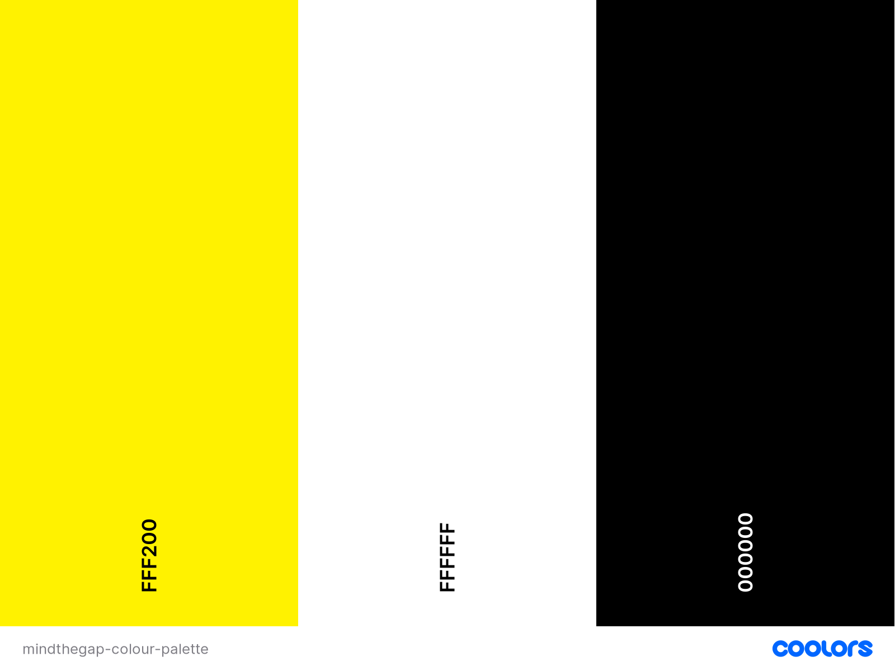

# **Mind the Gap Website**

Mind the Gap is an interactive online aptitude test designed to help women find their calling in the technology industry. Women who have any sort of interest in a career in the technology industry will be encouraged to take this quiz!

Find our deployed site here: [Mind The Gap](https://awssg.github.io/mindthegap/)

This website was created for the Code Institute September 2022 Hackathon themed around the gender gap in the technology industry.

# **User Experience (UX)**

- As a user I want to know if I have any skills or aptitude for a career in the technology industry.

## **Design**

## **Colour Scheme**

The colours selected for this site were yellow(`color: #FFF200;`), white(`color: #FFFFFF;`) and black(`color: #000000;`). These colours were selected to incorparate a minimalist design and invoke a "mind the gap" feeling, which informs the user on the close the gap theme of this site.

Additionally, the results meter featured at the end of the quiz has alternate colours `color; #009578;`, and `color: #004033;` both of which are cyan variants. The purpose of this colour selection is to have the results meter stand out on the page and attract the users attention.

## **Typography**

Roboto was selected as the primary font for this site. It was selected due to its simplicity and it doesn't detract too much from the content of the quiz. Additionally Roboto is in keeping with the minimalist design philosphy of the site.

## **Imagery**

All images used were taken from free sources. 

## **Wireframes**

### **Mobile**

#### Homepage on Mobile

#### Questions Page on Mobile

#### Results Page on Mobile

### **Desktop**

#### Homepage on Desktop

#### Questions Page on Desktop

#### Results Page on Desktop

# **Features**

## **Existing Features**

- __Quiz__
The quiz consists of different questions, all of which feature multiple answers. The quiz features dynamic flow and questions. These questions are designed to see if the user has any skills or aptitiude suitable for a career in technology.

- __Next Button__
A button found at the bottom of each question to move onto the next question.

- __Back Button__
A button found at the bottom of each question to move onto the next question.

- __Results Meter__
This is a graphical interfact that displays the users results as a percentage. The semi-circle will be filled in according to the users final score on the quiz. This for the user to easily read and visualize their respective score.

- __Footer__
Footer features links to each contributer of this website. Additionally it features the hackathon name and team name. 

- __Header__
The header features an image with the words Mind the Gap, on a train platform. This alerts the user to the theme of this project, which is to close the gender gap.

## **Features Left to Implement**

- __Alternate Branching Questions__
At the begininng of the planning phase for this site, there were multiple branching streams of questions that all had alternative paths, with alternative questions. This is a feature which will be added with more time.

- __Informational Text Overlays__
Between each question have a screen overlay with text, images and quotes from famous women within the technology industry.

# **Technologies Used**

## **Languages Used**

- JavaScript (JS) was the primary programming language for this project and was used to run and operate the gladiator game and its respective features. It was also used alongside HyperTextMarkup Langugae and Cascading Style Sheets to illustrate and interact with the user. [JavaScript](https://en.wikipedia.org/wiki/JavaScript)
- HyperTextMarkup Langugae (HTML) was utilised for the main content of the website and as the standard markup language. It was also used because of its ability to be used alongside Cascading Style sheets programming language. [HTML](https://en.wikipedia.org/wiki/HTML)
- Cascading Style Sheets (CSS) was the programming langugae used in conjunction with HTML. It was used to present the markup langugae HTML. CSS was used to put the HTML into a presentable form. [CSS](https://en.wikipedia.org/wiki/CSS)

## **Frameworks, Libraries & Programs Used**

[Balsamiq](https://balsamiq.com/) - Used to create wireframes.

[Bootstrap](https://www.w3schools.com/whatis/whatis_bootstrap.asp)

[Git](https://git-scm.com/) - Git was the technology used for version control. It is free and open sourced.

[Github](https://github.com/) - To save and store files on website.

[Google Fonts](https://fonts.google.com/) - To import the fonts used on the website. 

[Coolors.co](https://coolors.co/) - For colour palletes.

[Font Awesome](https://fontawesome.com/) - For the iconography on the website. 

Google Dev Tools - To troubleshoot and test features, solve issues with responsiveness and styling.

[Tiny PNG](https://tinypng.com/) - To compress images.

[Favicon.io](https://favicon.io/) - To create favicon. 

[Am I Responsive?](https://ui.dev/amiresponsive) - To show the website image on a range of devices. 

# **Testing**

- JavaScript
 - script.js Validation: No errors were returned when passing through the official [JSHint](https://jshint.com/)
  - 

- Html
 - Index Page Validation: No errors were returned when passing through the official [W3C validator]()
  - 

- CSS
 - No errors were found when passing through the official [(Jigsaw) validator]()
  - 

## **Testing User Stories from User Experience (UX) Section**

### **First Time Visitor Goals**

- As a user I want to know if I have any skills or aptitude for a career in the technology industry.
    - 

## **Known Bugs**

- Reselecting answers adds additional points to the users score, putting their score out of 0 - 100% range. 

# **Deployment**

## **GitHub Pages**

The project was deployed to GitHub Pages using the following steps:

1. Log in (or sign up) to GitHub.

2. Find the repository for this project, mindthegap.

3. Click on the Settings link.

4. Click on the Pages link in the left hand side navigation bar. 

5. In the Source section, choose main from the drop-down select branch menu. Select Root from the drop-down select frolder menu. 

6. Click Safe. Your live GitHu Pages site is not deployed at the URL shown. 

## **Forking the GitHub Repostiory**

By forking the GitHub Repository we make a copy of the original repository on our GitHub account to view and/or make changes without affecting the original repository by using the following steps:

1. Log in (or sign up) to GitHub

2. locate the GitHub Repository, mindthegap.

3. At the top of the Repository just above the "Settings" Button on the menu, locate the "Fork" Button.

4. You should now have a copy of the original repository in your GitHub account.

## **Making a Local Clone**

To clone the mindthegap repository:

1. Log in (or sign up) to GitHub. 

2. Go to the repository for this project, mindthegap. 

3. Click on the code button, select whether you would like to clone with HTTPS, SSH or GitHub CLI and copy the link shown.

4. Open the terminal in your code editor and change the current working directory to the location you want to use for the cloned directory. 

4. Type 'git clone' into the terminal and then paste the link you copied in step 3. 

5. Press 'Enter'. 

# **Credits**

## **Code**

- JavaScript code, HTML and CSS for results meter logic was taken from a YouTube tutorial (https://www.youtube.com/watch?v=FnUkVcQ_3CQ&ab_channel=dcode)

## **Content**

All content was written by developer. 

## **Acknowledgments**

We would like to thank SodaSocial, Deloitte, and Code Institute for hosting the hackathon event which led to the development and deployment of this site.

Additionally we would like to thank all the event contributers and mentors. In particular Jim and Anthony for their support.
